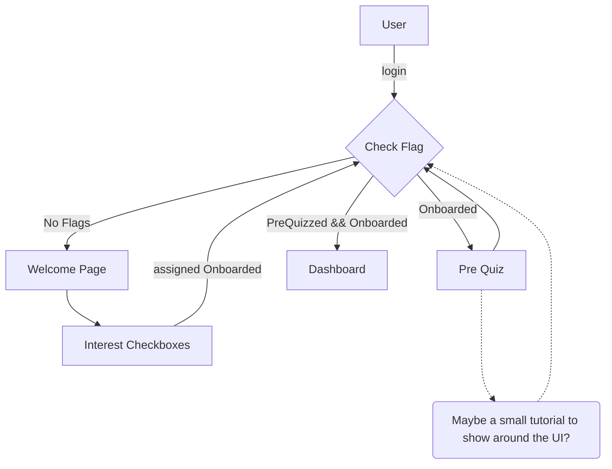

See [User Flags](userFlags.md)

```mermaid
flowchart TD
    usr[User] -- login --> flagCheck{Check Flag}
    flagCheck -- No Flags --> welcome[Welcome Page]
    flagCheck -- Onboarded --> preQuiz[Pre Quiz]
    welcome --> interest[Interest Checkboxes]
    interest -- assigned Onboarded --> flagCheck
    preQuiz ..-> tutorial(Maybe a small tutorial to show around the UI?)
    tutorial .-> flagCheck
    preQuiz --> flagCheck
    flagCheck -- PreQuizzed && Onboarded --> dashboard[Dashboard]
```